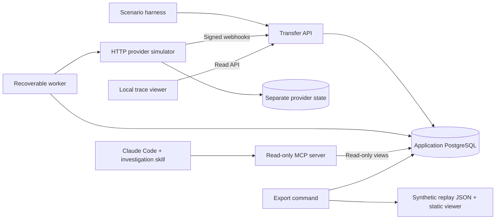

# Architecture

Design baseline, now implemented as described (deviations are recorded in [DECISIONS.md](DECISIONS.md)). One repository, three runtime processes (API, worker, provider simulator) plus the on-demand MCP server.

## Baseline stack

Node.js 24 LTS, strict TypeScript, npm; PostgreSQL; a small HTTP framework (Fastify is a reasonable default); explicit SQL migrations and `pg` or an equally transparent driver; Vitest and Testcontainers; the official MCP TypeScript SDK; a small React/Vite trace viewer if useful. Verify current compatibility before installing. A single root package is sufficient; workspaces are optional, not an objective.

Use PostgreSQL-backed jobs, not a broker in v1. The transfer acceptance transaction writes both state and a job row. Workers lease jobs with bounded expiry and ownership tokens. Never hold a DB transaction open across provider HTTP requests. A stale worker must not overwrite a newer worker's result: fence writes with a lease token/version and enforce monotonic domain transitions. Provider idempotency protects repeated external attempts after an expired lease.

## Suggested boundaries

- `src/domain/`: amounts, valid transitions and journal rules; no HTTP or database dependencies.
- `src/db/`: migrations, transactions, repositories and read-only views.
- `src/api/`: validation, HTTP contracts, webhook receiver and trace endpoints.
- `src/worker/`: leased work, provider submission and resolution of unknown outcomes.
- `src/provider-sim/`: external contract simulator; cannot read application DB state.
- `src/mcp/`: read-only tools over bounded read models.
- `src/scenarios/`: repeatable reset/seed/fault orchestration, separate from normal API routes.
- `web/`: trace visualization; `tests/`: unit, integration, contract, MCP and browser tests.
- `artifacts/examples/`: deliberately selected, generated synthetic replay samples with provenance.

Actual layout: as above, plus `src/app/` (transactional application services shared by API, worker and MCP: acceptance, evidence handling, webhook intake, invariants, read models), `src/shared/` (clock, IDs, logger, checkpoints), `migrations/` (SQL), `evals/` (agent rubric and runs). Reviewed public replays live in `web/public/replays/` instead of `artifacts/examples/` so the static site is self-contained.

## Persistence and failure boundaries

The simulator needs its own database or independently credentialed schema so acceptance survives an application or simulator restart. It shares no business transaction with the application. One PostgreSQL container may host separate databases for convenience; explain that this does not simulate independent database-server outages.

Persist jobs, provider attempt references, inbox events and journal postings. In-memory timers are wakeups only, never the durable source of truth. Test process crashes at named checkpoints. Local DB effects are atomic; network calls are not.

The application never reads simulator tables to learn a payment outcome. It uses the simulator's lookup API or verified webhooks. The scenario harness can inspect simulator state as a test oracle, but label that privileged evidence and do not expose it to an investigation pretending to have only application observations.

## Boundaries and operation

Bind services to loopback by default. Explicit demo identities are not production authentication. Fixed provider destinations and bounded payloads avoid accidental arbitrary network requests. Separate application write credentials from read-only MCP credentials. Log correlation, operation and event IDs; redact secrets and authorization/signature material.

Static exports contain synthetic evidence only. GitHub Pages may later serve the viewer plus exports; it cannot serve the worker or MCP process. Do not automatically deploy a service or register remote MCP servers.
